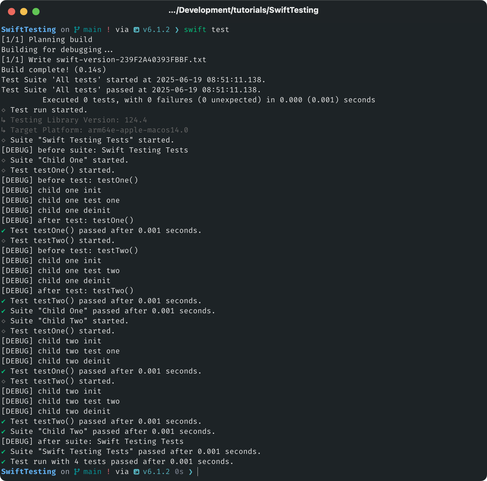

# Swift Testing

Requires Swift 6.1 (Xcode 16.2)

* `TestScoping` with `SuiteTrait` for suite setup / teardown
* `TestScoping` with `TestTrait` for granular test setup / teardown
* Nested `@Suite` children

